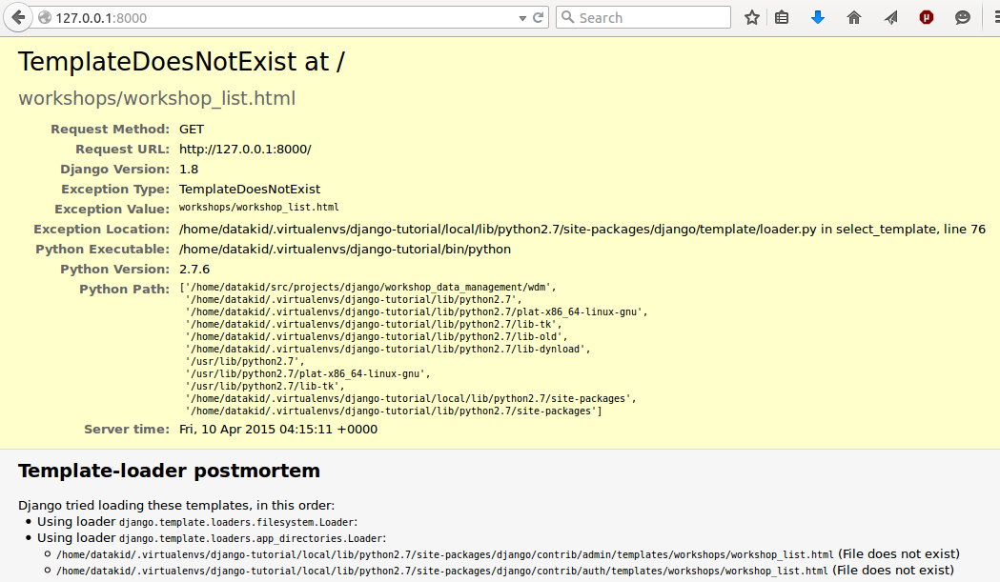

=================================================
Learning practical databases via a Django web app
=================================================

Tutorial 2
==========

Preamble
--------

In the last tutorial we did a lot of thinking about how our data would look
from a database perspective. This is a valuable tool that will take some time
to perfect, but is a good start - seeing dead ends really helps.

In this tutorial we will be expanding our Django skills to the **presentation**
layer - ie, how our data will look in a web browser.

Once we have a general understanding of what tools are available to us, and how
our pages will look, we will be able to see what and where we are able to 
manipulate the **control** layer - how to manipulate the data to give us more
control at the presentation layer.

------------------
What we will learn
------------------

The first tutorial was largely based around app/models.py.

In this tutorial we will see with a few quick lines of code in urls.py and 
views.py, and an html template or two, how powerful Django really can be in 
bringing your data to the web for ease of use.

Workshop Project - Admin Views
------------------------------

We can quicky update our admin to make the admin web interface more sensible.

etc etc

Workshop Project - Views
------------------------

When we think about how we will need to see our data, it should be apparent 
that there are really only a couple of ways that are strictly necessary:

 - the List View, where we can see all of our objects in a list. At some point
    it would be nice to filter that list as well.
 - the Detail View, where we can see the individual fields of any particular
    data object (Workshop, Participant, etc)
 - the Add/Update view, where an object can be added or an existing object 
    edited
 - not strictly necessary, but a nice caution, is a Delete View. We could just
    delete objects as required, but we have *all* experienced the joy of seeing
    the "are you sure" window. Let's build one of those too.

Given that this is all about the Workshop, let's start with Workshops as our
example model. 

The Django developers understand that the above five views are often required,
so they have made some generic version of each, to make our lives easier. Let's
take a look - open up views.py.

::

    from django.shortcuts import render

    # Create your views here.

Boring. Let's ignore the first line, and remove the second and get started.

::

    from django.shortcuts import render 
    from django.views.generic import DetailView, ListView 
    from django.views.generic.edit import CreateView, UpdateView, DeleteView 
     
    from .models import Workshop 
     
    ''' 
    Workshop Views 
    ''' 

Traditionally we put django imports together, and other imports below. The two
new lines of Django imports bring in those default generic views. The next 
brings in the Workshop model, and the last three lines are a comment - this 
file may get long because of the number of models, so it's good to mark our 
spot.

::

    from django.shortcuts import render 
    from django.views.generic import DetailView, ListView 
    from django.views.generic.edit import CreateView, UpdateView, DeleteView 
     
    from .models import Workshop 
     
    ''' 
    Workshop Views 
    ''' 

    class WorkshopList(ListView):
        model = Workshop

    class WorkshopDetail(DetailView):
        model = Workshop

    class WorkshopCreate(CreateView):
        model = Workshop
        fields = ['title','description','start_date','teaching_hours','catering']
     
    class WorkshopUpdate(UpdateView):
        model = Workshop

    class WorkshopDelete(DeleteView):
        model = Workshop

These should be fairly self explanatory. The only thing that does warrant 
explanaition is the CreateView **does** require the second variable "fields" in
order to function. Any fields that are not on this list aren't on the 
automatically generated web form. 

Aside
*****

For an example of when we might want to exclude information from a form, here's 
a quick example:

*models.py*

::

    class ImportantInformation(models.Model):
        title = models.CharField(max_length=100)
        description = models.CharField(max_length=400, blank=True, null=True)
        ImportantNumber = models.IntegerField()
        
        date_of_last_change = models.DateField(auto_now=True)
        last_changed_by = ForeignKey(User)

As you can see here, we are keeping a record of when the data was last changed
and who the last user was that changed the data. Neither of these fields will
be filled in by the user themselves, we will do this in the background. The
easiest way to do this is to *override* the save() method:

:: 
    
    class ImportantInformation(models.Model):
        title = models.CharField(max_length=100)
        description = models.CharField(max_length=400, blank=True, null=True)
        ImportantNumber = models.IntegerField()
        
        date_of_last_change = models.DateField(auto_now=True)

        def save(self):
            self.date_of_last_change = datetime.datetime.now()
            super(ImportantInformation, self).save()

Here we tell Django that when it saves an ImportantInformation object, that it
should first record the date of last change as now() according to the 
computer's internal clock, and then call the regular save method (which we 
don't have to define, it's done for us).

Workshop Project - URLs 
-----------------------

We have now created some views - very simplistic, yet generic, ways of how we 
would like our data presented. How do we make these views real? 

For a quik primer, here is how it all fits together:

data-description (models.py) -> 
data munged for web (views.py - note, this is in python) -> 
urls.py (how do we get to those views) -> 
templates/x.html (what the browser will use to render those views)

Let's write the URLs.

First, we need to adjust the urls at the top level - the Project level. 
We called our project workshop_data_management and our app workshops.

Because we like to keep this modular, we will need to edit two files:

First we edit the project urls, so it knows where to fine the pp urls:

workshop_data_management/urls.py 

::

    from django.conf.urls import patterns, include, url
    from django.contrib import admin

    urlpatterns = patterns('',
        # Examples:
        # url(r'^$', 'workshop_data_management.views.home', name='home'),
        # url(r'^blog/', include('blog.urls')),

        url(r'^admin/', include(admin.site.urls)),
        # Everything above this line should be default in your urls
        # so we just point to our new app's urls:
        url(r'^', include('workshops.urls')),
    )

What this tells Django is:

 - when a user goes to `http://url.com/admin`_ use the urls within the admin* app
 - when a user goes to `http://url.com/`_ use the urls within the workshops app

(The admin app comes out of the box - we don't need to create anything to use 
it apart from admin.py)

Second, we will edit the workshops's urls.py to point to each view. You may 
need to create this file if it doesn't exist.

workshops/urls.py

::

    from django.conf.urls import url, patterns

    from .views import WorkshopList, WorkshopDetail, WorkshopCreate, WorkshopUpdate, WorkshopDelete

    urlpatterns = patterns('',
        url(r'^$', WorkshopList.as_view(), name='index'),
        url(r'^workshops/$', WorkshopList.as_view(), name='index'),
        url(r'^workshops/add/$', WorkshopCreate.as_view(), name='workshop_add'),
        url(r'^workshops/(?P<pk>[0-9]+)/$', WorkshopDetail.as_view(), name='workshop_detail'),
        url(r'^workshops/(?P<pk>[0-9]+)/update/$', WorkshopUpdate.as_view(), name='workshop_update'),
        url(r'^workshops/(?P<pk>[0-9]+)/delete/$', WorkshopDelete.as_view(), name='workshop_delete'),
    )

Despite only adding 10 lines of code, we have now defined all the Workshop urls
we will need in the short term. Let's take a look at what it all means.

The first two lines are standard - they are bringing in the tools we need to
build and direct the urls.

The url patterns are where the really interesting stuff happens. 

For a quick reference point, (?P<pk>[0-9]+) means "a list of numbers that will
represent the pk (primary key or id number) of any particular workshop."

These urls will now work:

* http://url.com/ - will give us a list of all the workshops that are available
* http://url.com/workshop/ - will give us a list of all the workshops that are 
  available
* http://url.com/workshop/add/ - will take us to a page where we can create a 
  new workshop
* http://url.com/workshop/1 - will take us to the detail page of the workshop
  with primary key 1 (pk=1)
* http://url.com/workshop/256 - will take us to the detail page of the workshop
  with primary key 256 (pk=256)
* http://url.com/workshop/23/update/ - will take us to the page where we can 
  update the details of workshop with pk=23
* http://url.com/workshop/23/delete/ - will take us to the page where we can 
  delete the workshop with pk=23

Hopefully you can see how powerful what we have just done is - with 10 lines 
of code, we have created *all* of possible urls we will need for all of the
workshops.

And yes, it will be this easy for all of the other objects as well. 

Workshop Project - Templates
----------------------------

If we now start the development server and go to 127.0.0.1:8000/ we should see 
some results:

Template does not exist! Ok, so we have a data model, we know what shape to 
deliver that data in (views), we know where to deliver it (urls). Now is the
time to render that data.

This is a multi part step, but is the last one - we are almost there.

At the top level of the project - in the same folder as the manage.py
file, add a directory called templates, templates/admin and 
templates/workshops.

::

    $ mkdir -p templates/admin
    $ mkdir templates/workshops

(mkdir -p says "make all the folders that don't exist", we don't need it on the 
second line because we know that templates exists from the previous command)

Because we want to reduce our typing as much as possible, we will put most of
our HTML in a template that we call from within the individual files.

You will find in the repository that there is a templates/base.html file. If
you read it closely it will make some sense to those that have a moderate html
understanding. If you don't, don't worry. It's not that important in the short
term.

Once these files are in place, reload the server and you will see a very boring
website. To make it pretty we use CSS and JS. Neither HTML, CSS, nor JS are 
part of this course, so we are going to take a short cut.

Download Bootstrap, the CSS and JS that make Twitter all beautiful (it's FREE).

`Bootstrap <https://github.com/twbs/bootstrap/releases/download/v3.3.4/bootstrap-3.3.4-dist.zip>`_

